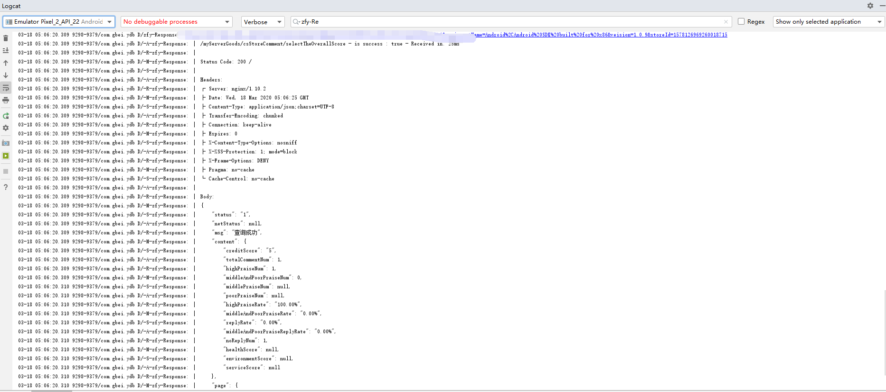

<p align="center">
    <a href="https://bintray.com/beta/#/buyaomiege/RequestInterceptor/RequestInterceptor">
    
</a>
</p>

# Interceptor
okhttp日志拦截格式化打印  
来源MVPArms  https://github.com/JessYanCoding/MVPArms  
Logtag:  
zfy-Req 看请求地址  
zfy-Res 看返回数据  
zfy-Re  请求地址和返回数据  
## 效果

## 使用
1.implementation 'com.buyaomiege:requestinterceptor:1.0.2'  
2.addInterceptor(new RequestInterceptor(RequestInterceptor.Level.ALL))

### 如果okttp冲突
```
implementation ('com.buyaomiege:requestinterceptor:1.0.2'){  
    exclude module: "okhttp"  
}
```